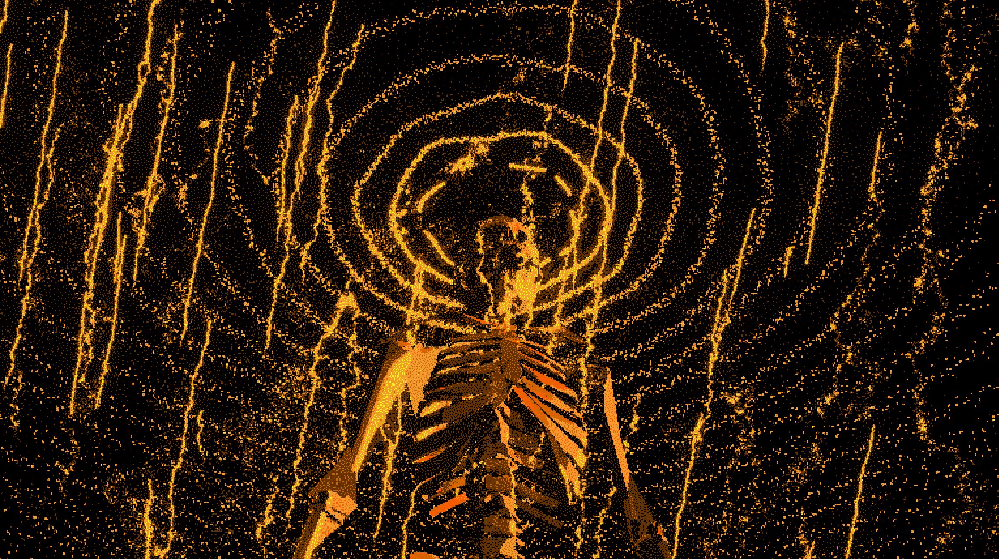

# Ghouls Timeline

**Ghouls Timeline** is a WebGL artwork built with [three.js](https://threejs.org/).  
It renders a 3D skull with jaw animation, procedural particle rings, a biased random-walk starfield, bloom → pixelation → palette quantization with blue-noise dithering — all in real-time.

<p align="center">
  
</p>

[Run the artwork live](https://protocell-labs.github.io/ghouls-timeline/) 💀📺

---

## Features
- **Skull + jaw** (separate GLBs) with mouse tracking, idle sway, and random jaw openings (only when mouse is in window).
- **Procedural ring particles** (Perlin-warped, periodic along θ, tilted & offset) rotating around Y.
- **Starfield** in a background XY plane built from **biased random-walk branches** + extra sprinkled stars.
- **Post-processing**: EffectComposer → UnrealBloomPass → custom ShaderPass (pixelation + palette quantization + animated blue-noise dithering).
- **Palettes**: retro sets (CGA, ZX Spectrum, C64, Game Boy, VGA/EGA, LCARS, EVA, mono variants) defined in `palettes.js`.
- **GUI (vanilla)**: dropdowns for **Palette** and **Material** (Normal/Lambert).
- **Screenshots**: press **S** to download a PNG of the current frame.

---

## Controls
- **Mouse move**: skull orientation.
- **Mouse leave**: smooth reset to idle.
- **Top-right menus**: palette & material.
- **S**: save screenshot (`skullshot_<random>.png`).

---

## Tech
- Three.js r138 modules via import map (OrbitControls, GLTFLoader, EffectComposer, RenderPass, UnrealBloomPass, ShaderPass).
- Custom full-screen shader for **pixelate → nearest-palette quantize → blue-noise dither**.
- `perlin.min.js` (ESM) for ring noise (`perlin2D`).

---

## Getting Started

```bash
git clone https://github.com/protocell-labs/ghouls-timeline.git
cd ghouls-timeline
npm install
npm run dev
# open the printed local URL (e.g. http://localhost:5173)
```

## License

MIT © 2025 protocell-labs