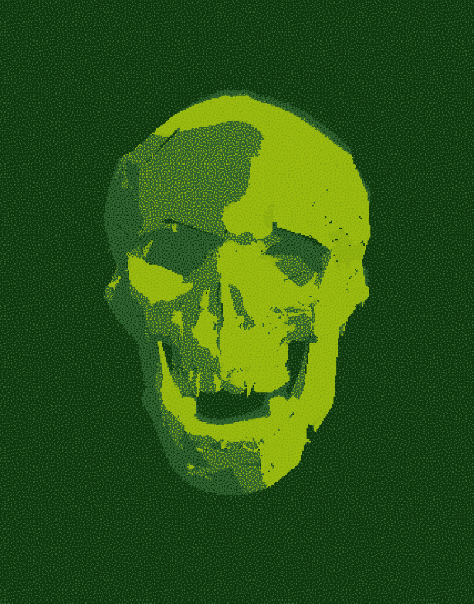
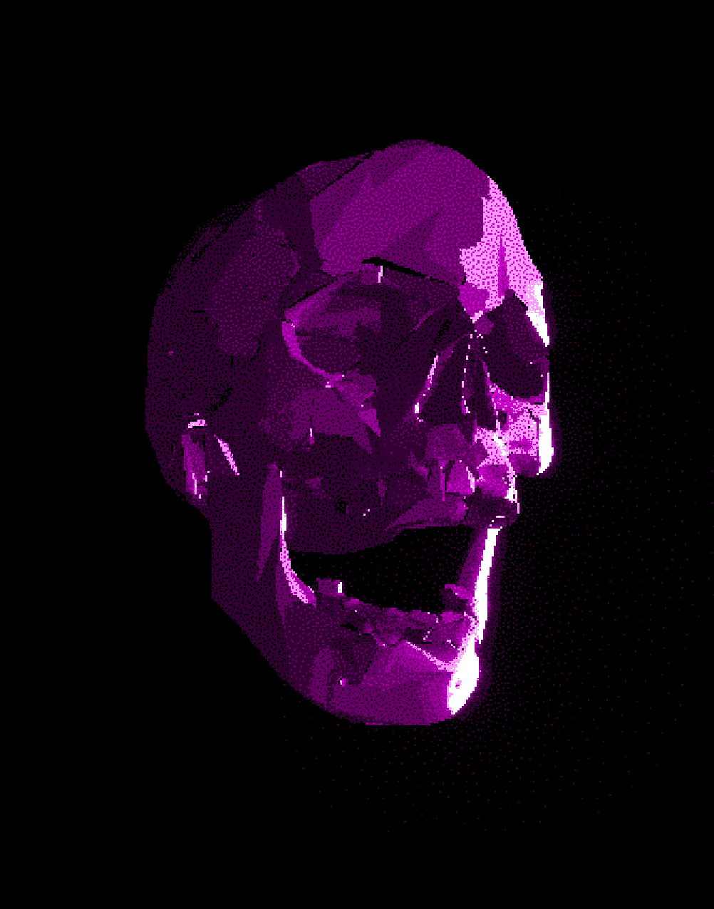

# Ghouls Timeline

**Ghouls Timeline** is a WebGL artwork built with [three.js](https://threejs.org/).  

<p align="center">
  
  
  
</p>


It renders a 3D skull with jaw animation, retro palettes, pixelation, dithering, and bloom effects — all running in real-time in the browser. Includes simple UI controls for palette and material selection, plus screenshot capture.

[Run the artwork live](https://protocell-labs.github.io/ghouls-timeline/) 💀📺


---

## Features
- Skull + jaw models with independent animation  
- Random jaw movement when active  
- Pixelation + blue noise dithering  
- Retro digital color palettes (CGA, ZX Spectrum, C64, Game Boy, EVA, LCARS, etc.)  
- Bloom post-processing  
- Simple GUI for palette & material switching  
- Screenshot capture (press **S**)  

---

## Getting Started

Clone the repo and run a local server (e.g. with [vite](https://vitejs.dev/) or [http-server](https://www.npmjs.com/package/http-server)):

```bash
git clone https://github.com/protocell-labs/ghouls-timeline.git
cd ghouls-timeline
npm install
npm run dev
```

## License

MIT © 2025 protocell-labs