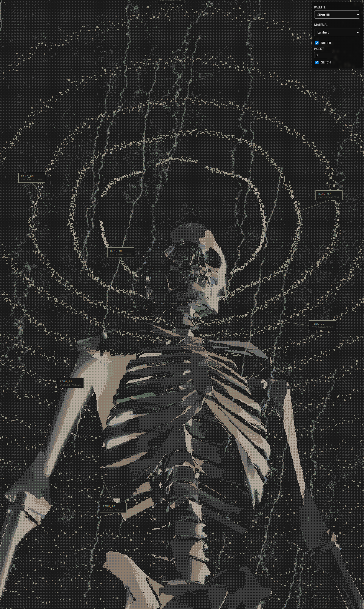
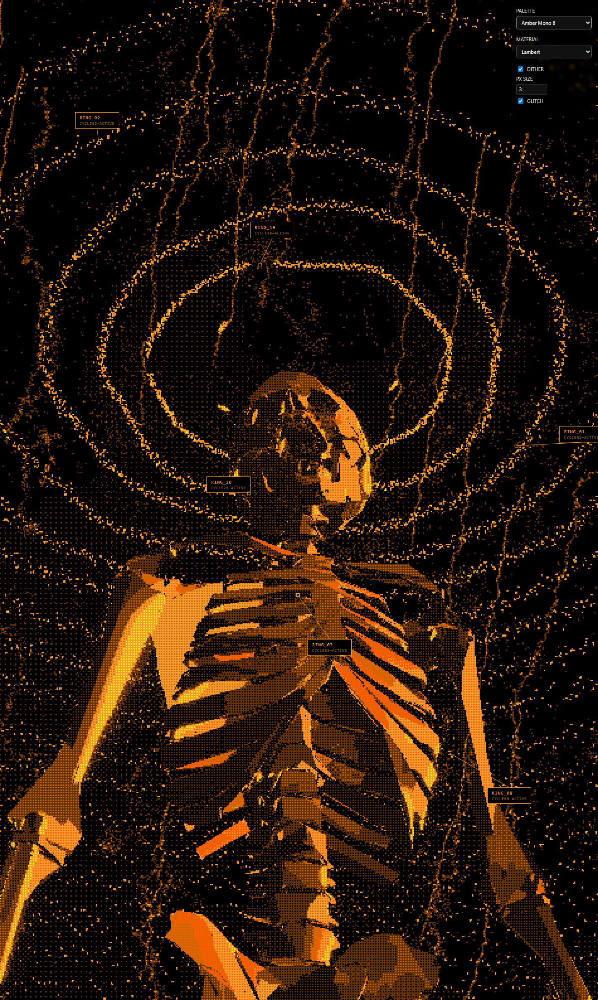
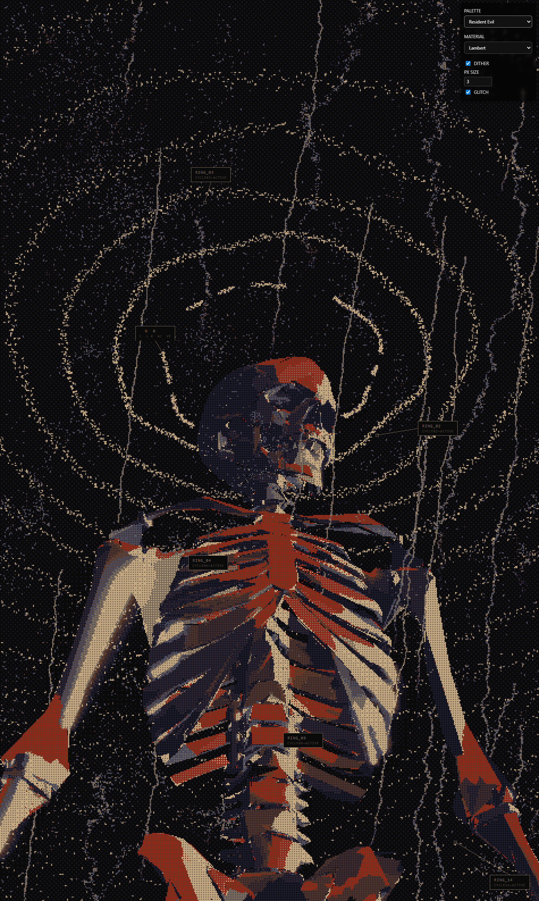

# Ghouls Timeline

**Ghouls Timeline** is a WebGL artwork built with [three.js](https://threejs.org/).  
A flat-shaded 3D skull with jaw animation, Perlin-warped particle rings, a random-walk starfield, and HUD tags — rendered through a PS1-inspired post-processing pipeline (bloom → pixelation → palette quantization → Bayer dithering).

<p align="center">
  
  
  
</p>

[Run the artwork live](https://protocell-labs.github.io/ghouls-timeline/)

---

## Features
- **Skull + jaw + torso** (separate GLBs) with flat shading, mouse tracking, idle sway, random jaw animation, and periodic vertex glitch effect.
- **Procedural ring particles** (Perlin-warped, periodic along theta) with segmented birth-gating animation.
- **Starfield** built from biased random-walk branches with animated trail sweeps.
- **HUD tags** — HTML/CSS overlays that track ring particles in real-time, with per-character glitch-in effect and palette-adaptive colors.
- **Post-processing**: bloom → pixelation → palette quantization → 4x4 Bayer ordered dithering.
- **Palettes**: 22 retro palettes (CGA, C64, Game Boy, ZX Spectrum, VGA/EGA, LCARS, EVA, Silent Hill, Resident Evil, Ridge Racer, PS1 Boot, mono variants).
- **GUI (debug)**: palette, material, dither toggle + pixel size, glitch toggle.
- **Screenshots**: press **S** to download a PNG.

---

## Controls
- **Mouse move**: skull follows cursor.
- **Mouse leave**: smooth reset to idle wobble.
- **Top-right menus**: palette, material, dither, glitch.
- **S**: save screenshot.

---

## Tech
- Three.js r138 via import map — no bundler, no build step.
- Modular ES modules: `main.js` (orchestrator), `skull.js`, `particles.js`, `starfield.js`, `postprocessing.js`, `tags.js`, `gui.js`, `palettes.js`.
- Custom vertex shader glitch (diagonal slice displacement + noise field) injected via `onBeforeCompile`.
- Custom full-screen shader for pixelate → nearest-palette quantize → Bayer dither.
- DPR-aware rendering for consistent pixel sizes across HiDPI and standard displays.

---

## Getting Started

No build step or dependencies required — just a static HTTP server.

```bash
git clone https://github.com/protocell-labs/ghouls-timeline.git
cd ghouls-timeline
npx http-server -p 8080
# open http://localhost:8080
```

## License

MIT © 2025 protocell-labs